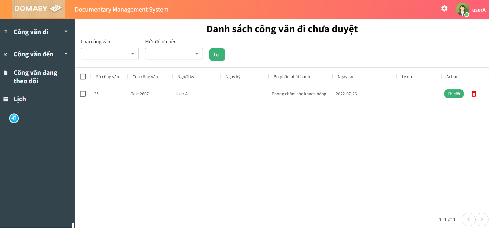
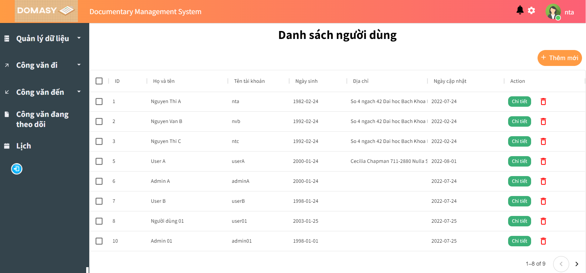
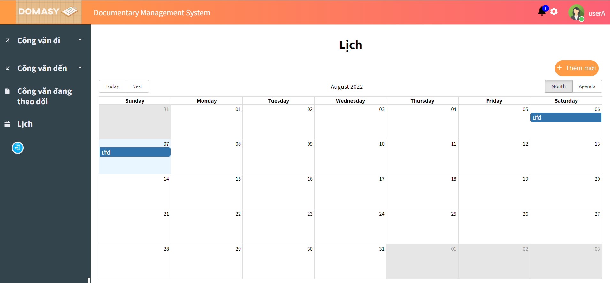

# Overview
<p align="center">An Internal Document Management System that is used to receive, track, manage and store documents with version control and real-time notifications features.</p>  

## Techonologies
### Back-end ([TanHM-1211](https://github.com/TanHM-1211))
* Framework: FastAPI (python), SQLAlchemy
* Database: MySQL
* Redis for caching and pushing notifications
### Front-end ([linhntt011112](https://github.com/linhntt011112))
* ReactJS, MUI
* UI is written in Vietnamese
## Features
* **Simple UI and User Flow**
* **Real-time notification**. No quota limits since the application uses its own Redis server and websocket connections, but can easily switch to [Pusher](https://pusher.com/).
* **Document's version control**
* **Simplified version of Oauth2 supported**. Only `access_token` is required, simpler but more vulnerable.

<!--  -->

# How to run
## Prerequisites

* Python 3.9.6
* Docker 20.10.16 and docker-compose 1.29.1
* npm 8.4.1 and node 17.5.0

Install back-end requirements using
```
cd backend && pip install -r requirements.txt
```
and front-end requirements 
```
cd frontend && npm install --force
```
---
## Run
### Database and redis

```
cd backend && \
COMPOSE_PROJECT_NAME=DMS docker-compose -f database/start_db_docker-compose.yml up -d
```

This command will download all necessary images, create and start containers with default settings (mysql and redis). Data is stored at (default) location ```backend/database/docker``` .


### Back-end
1.  Navigate to ```backend```
```
cd backend
```
2. (Optional) Change config:
* **config.py** (application's config): includes configurations of database, cors, caching and logging.
* **gunicorn_config.py** (server's config): includes configurations of server's worker, server's initialization logging location.
* **local_config.json** (file's config)
3. Start server (It's recommended to start server in a python virtual environment)
```
gunicorn -c ./gunicorn_config.py main:app
```

### Front-end
1.  Navigate to ```frontend```
```
cd frontend
```

2. (Optional) Change config:
* **src/config/backend.jsx**: Only ```BACKEND_URL``` variable should be changed as it point to your back-end's origin (scheme, hostname and port)
3. Start front-end in development mode:
```
npm start
```

## Deploy
1. Switch to branch ```deploy```
2. Change config files if necessary and build front-end 
```
cd frontend
npm run build
mv build prod_build
```
3. Run back-end and front-end as services (for creating these services, see ```systemd.service```)
4. Configure nginx (see ```nginx.conf```) and add a HTTPS certificate using tools like [Certbot](https://certbot.eff.org/)

This branch was deployed to AWS following these instructions and was available at [domasy.site](https://domasy.site) (The AWS server has been turned off due to low budget, but it will be re-opened when the time comes).

---
# Database
Since almost all of the UI is Vietnamese, we found it easier to have some core tables written in Vietnamese as well.  
## Schemas

## Notification-related tables
*nguoi_dung : User in Vietnamese*


# Realtime Notification
A diagram is worth a thousand words.  


# Screenshots

<div style="position: relative;
  width: 50%;
  float: left;
  height: 100%;
  z-index: 1010101010">
  
</div>
<div  style="position: relative;
  width: 50%;
  float: left;
  height: 100%;
  z-index: 1010101010">
  
  
</div>
  
<div style="position: relative;
  width: 50%;
  float: left;
  height: 100%;
  z-index: 1010101010">
  
  
</div>
<div  style="position: relative;
  width: 50%;
  float: left;
  height: 100%;
  z-index: 1010101010">
  
</div>